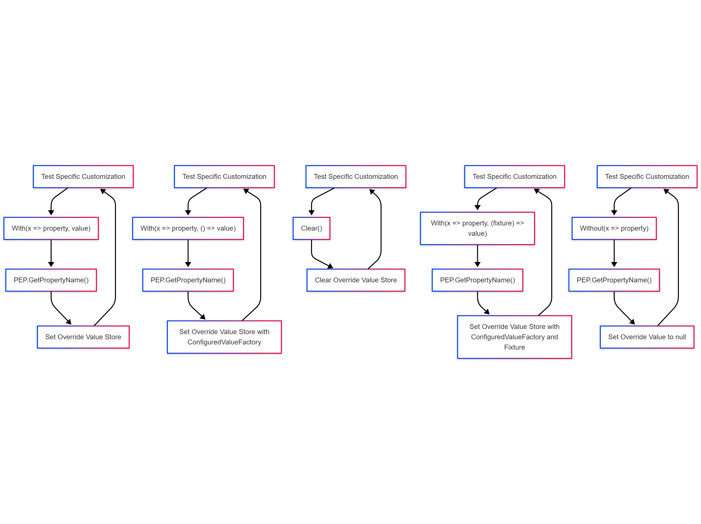
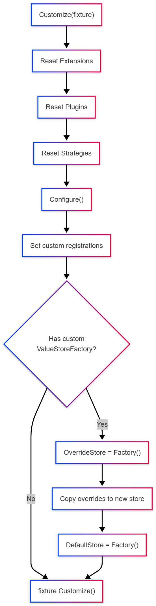
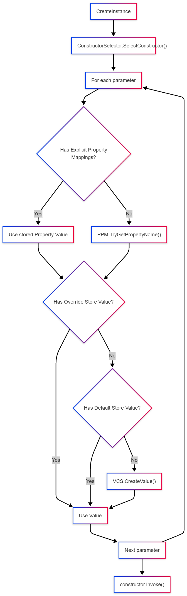
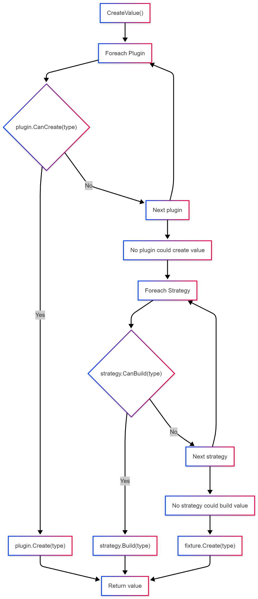

# Creation Pipeline: ConstructorCustomization to Final Value

This page explains the full lifecycle from a new `ConstructorCustomization<T>` instance to the final constructor argument values that are used to create `T`.

## At a glance

The package resolves each constructor argument with this priority:

1. Test override store (`With`, `Without`)
2. Default store (`SetDefault`)
3. Generated value (`IValueCreationService` pipeline)

Within generated values, the `IValueCreationService` pipeline is:

1. Plugins (`IValueCreationPlugin`)
2. Specimen strategies (`ISpecimenBuilderStrategy`)
3. AutoFixture fallback (`fixture.Create(...)`)

## Test Customization flowchart
Called from a test method directly on the `ConstructorCustomization<T>` instance.
```csharp
var customization = new ConstructorCustomization<T>()
    .With(x => x.Property, value)
    .Without(x => x.Property);
```



## Customize method flowchart
Called when the `ConstructorCustomization<T>.Customize(IFixture)` method is called, either directly or via `fixture.Customize(...)`.

```csharp
var fixture = new Fixture();
var customization = new ConstructorCustomization<T>();
customization.Customize(fixture);
```


## Create instance flowchart
Called when `ConstructorCustomization<T>` creates an instance of `T` via the `CreateInstance` method.

```csharp
var fixture = new Fixture();
var customization = new ConstructorCustomization<T>();
customization.Customize(fixture);
var instance = fixture.Create<T>(); // <-- calls CreateInstance
```



## Default Value Creation flowchart
Used when the default `ValueCreationService` is used to create a value for a constructor argument.
```csharp
var fixture = new Fixture();
var customization = new ConstructorCustomization<T>();
customization.Customize(fixture);
var value = fixture.Create<T>(); // <-- calls ValueCreationService pipeline
```
